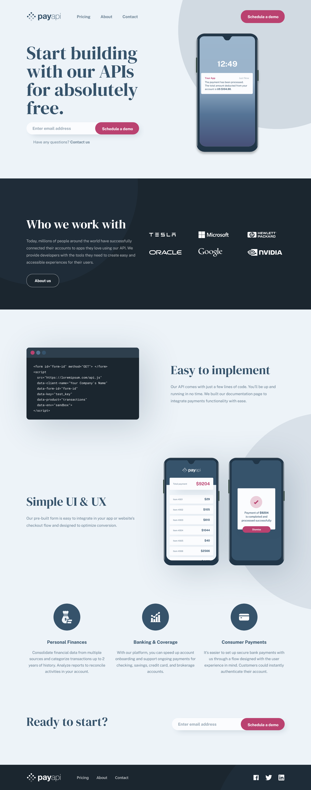

# Frontend Mentor - PayAPI multi-page website solution

This is a solution to the [PayAPI multi-page website challenge on Frontend Mentor](https://www.frontendmentor.io/challenges/payapi-multipage-website-FDLR1Y11e). Frontend Mentor challenges help you improve your coding skills by building realistic projects.

## Table of contents

- [Overview](#overview)
  - [The challenge](#the-challenge)
  - [Screenshot](#screenshot)
  - [Links](#links)
- [My process](#my-process)

  - [Built with](#built-with)
  - [What I learned](#what-i-learned)
  - [Continued development](#continued-development)
- [Author](#author)

## Overview

### The challenge

Users should be able to:

- View the optimal layout for each page depending on their device's screen size
- See hover states for all interactive elements throughout the site
- Receive an error message when the contact form is submitted if:
  - The `Name`, `Email Address` or `Message` fields are empty should show "This field can't be empty"
  - The `Email Address` is not formatted correctly should show "Please use a valid email address"

### Screenshot

### Links

- Solution URL: [https://www.frontendmentor.io/solutions/payapi-multi-page-website-91NDfWDkQy]
- Live Site URL: [https://payapi-multi-page-website-eight.vercel.app/]

## My process

### Built with

- Vite
- Tailwind v4
- Typescript
- react-hook-form
- react-router
- Mobile-first workflow

### What I learned

Since I got so used to working with create-react-app and NextJs, I decided to challenge myself with using Vite for the first time, and managing routes with react-router. I learned how to set up a project with vite, and why I should use it in the first place. I learned a few things about passing native props to custom components, and how to handle that with typescript. I also learned how to use react-hook-form, and how to set up a layout/routing file system with react-router v6. This is not my usual tech stack, it was a bit difficult to get used to at first, but after completing this project I am more confident in my skills.

### Continued development

I am still not too familiar with the aforementioned technologies, and would like to continue using them. Most of all, I'd like to improve in creating custom components, styling with tailwind and using typescript.

## Author

- Frontend Mentor - [@davidGasasnov](https://www.frontendmentor.io/profile/davidGasanov)
